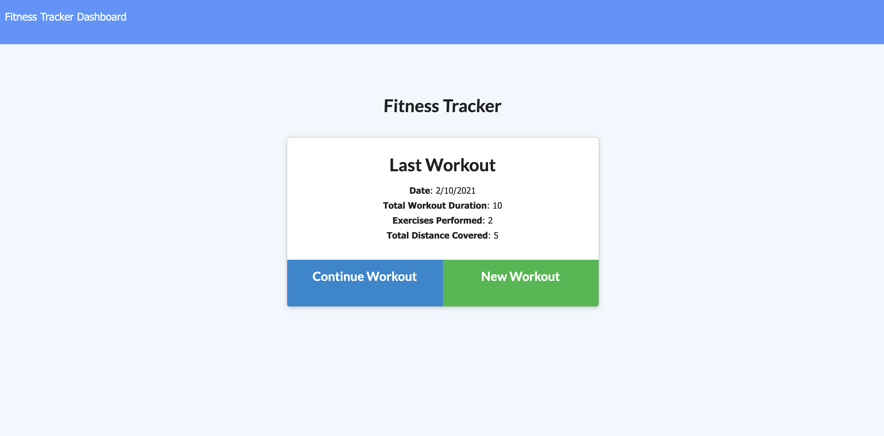
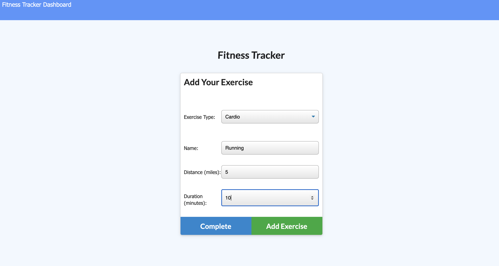
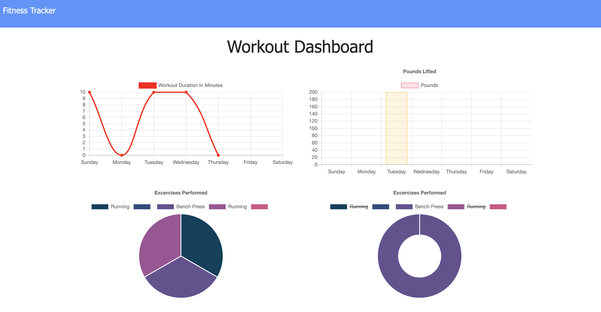

# Fitness-Tracker

## Description

- As a user, I want to be able to view create and track daily workouts. I want to be able to log multiple exercises in a workout on a given day. I should also be able to track the name, type, weight, sets, reps, and duration of exercise. If the exercise is a cardio exercise, I should be able to track my distance traveled.

A consumer will reach their fitness goals more quickly when they track their workout progress.

## Deployed Link

https://enigmatic-falls-23111.herokuapp.com/stats

## Images

## Installation

npm init to get all the required node modules
When running the code locally the local host is set to port 3000
Will need to go in to the config folder and possibly change the config.json values
To start the app use server.js.

## Languages

Mongo database
Mongoose schema
Handle routes with Express

## Contribute

The following is a set of guidelines for contributing. These are just guidelines, not rules, so use your best judgement and feel free to propose changes to this document in a pull request.

Issue: Ensure the bug was not already reported by searching on GitHub under issues. If you're unable to find an open issue addressing the bug, open a new issue. Write detailed information: For example:

How to reproduce the issue, step-by-step. The expected behavior (or what is wrong). Screenshots for GUI issues. The application version. The operating system.

Pull Requests: Pull Requests are always welcome.

When you edit the code, please run npm run test to check the formatting of your code before you git commit. Ensure the PR description clearly describes the problem and solution. It should include: The operating system on which you tested. The relevant issue number, if applicable.

## License

MIT
